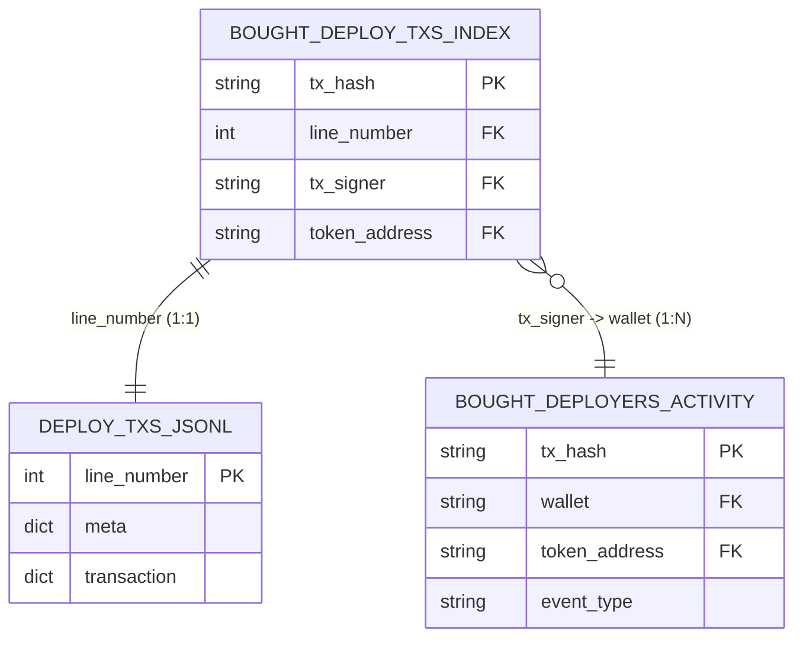

# Join Map

This document establishes the primary keys and relationships between the raw dataset files.

## Safe Join Strategies

### 1. Payload Enrichment (1:1)
To extract Jito tips, priority fees, and socials for the 15,927 bought tokens:
- Use `line_number` (implicit row index) from `bought_deploy_txs_index.parquet` to perfectly align with the rows in `deploy_txs.jsonl`.

### 2. Historical Deployer Activity (1:N)
To build deployer reputation features (e.g., past success, rug rate, wallet age):
- Key: `bought_deploy_txs_index.tx_signer` == `bought_deployers_activity.wallet`
- **CRITICAL LEAKAGE PREVENTION:** The join must be followed by a strict time filter: `bought_deployers_activity.timestamp < bought_deploy_txs_index.blockTime`.

### 3. Universe Labeling (Positives vs Negatives)
To construct the training dataset:
- Base table: Filter `bought_deployers_activity.parquet` where `event_type == 'launch'`.
- Positives: Where `bought_deployers_activity.tx_hash` exists in `bought_deploy_txs_index.tx_hash`.
- Negatives: Where it does not exist.
