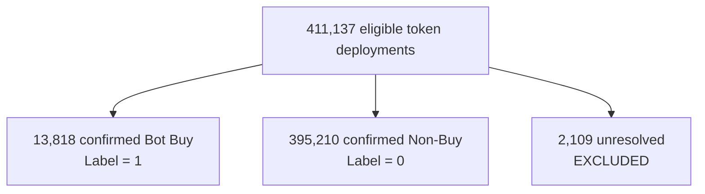

<div align="center">


# 🌌 Zero-Block Deconstruction

**Reconstructing the dominant observable decision policy of a Solana sniper using point-in-time on-chain evidence.**

[](https://youtu.be/c9CdFHTLMJM)
[](https://pumpfun-zero-block-deconstruction.vercel.app/)
[](https://github.com/shambhushekharsinha-engg/pumpfun-zero-block-deconstruction)
[](LICENSE)

<br/>


</div>

---

<details open>
<summary><b>📑 Table of Contents</b></summary>

- [Research Question](#-research-question)
- [Dataset & Label Accounting](#-dataset--label-accounting)
- [Results](#-results)
- [Evidence Boundary](#️-evidence-boundary)
- [Causal-in-Time Feature Construction](#-causal-in-time-feature-construction)
- [Dominant Behavioral Fingerprint](#-dominant-behavioral-fingerprint)
- [Engineering: Dependency-Free Serverless Inference](#-engineering-dependency-free-serverless-inference)
- [Repository Structure](#️-repository-structure)
- [Live Demo](#-live-demo)
- [Reproduction](#-reproduction)
- [Developer Profile](#-developer-profile)
- [License](#️-license)

</details>

---

## 🔬 Research Question

We analyze the target bot (`5brv79eFZ2rGprXNvqgVJBkBptkkw8GJX1XydJyZLyAr`) and ask:

> **_Can a purely point-in-time on-chain behavioral fingerprint explain the bot's token selection decisions?_**

This is a behavioral reconstruction, not an economic replication. We explicitly distinguish what we can observe from what the dataset does not expose.

---

## 📊 Dataset & Label Accounting



**Baseline prevalence (test set): 4.74%**

> [!IMPORTANT]
> **Unknown ≠ Negative.** The 2,109 unresolved selections could not be mapped to the deployment universe. They are excluded from all training and evaluation — they are never relabeled as negatives.

---

## 📈 Results

Model evaluated on a **frozen chronological test set** (15% of data, never touched during model selection).

| Metric | Random Baseline | Frozen Model | Unseen Deployers |
|:---|:---:|:---:|:---:|
| **PR-AUC** | 0.047 | **0.286** | **0.396** |
| **Precision @ Top-5%** | — | **31.7%** | — |
| **Bot Capture (Recall)** | — | **47.8%** | — |
| **Selection Ratio** | — | **1.50×** | — |

> [!NOTE]
> The unseen-deployer PR-AUC of **0.396** (+8.4× over baseline) provides strong evidence that the learned signal captures transferable behavioral structure rather than relying on deployer identity memorization.

---

## 🛡️ Evidence Boundary

| Category | Items | Observed? |
|:---|:---|:---:|
| **Directly Observed** | Deployment events, deployer activity, timestamps, historical launches/buys/sells/burns | ✅ Yes |
| **Reconstructed** | Point-in-time deployer history, behavioral selection regime | ✅ Derived |
| **Not Observable** | Target bot buy latency, entry size, exit history, realized P&L, slippage, bot sell transactions | ❌ Absent |

**Therefore: No economic superiority claim is made. No fabricated P&L.**

---

## 🔒 Causal-in-Time Feature Construction

> *"Causal-in-time" here refers to point-in-time information availability at decision time — not causal inference or intervention effects.*

All five features are aggregated strictly at $t_{decision}$ using only events from $t < t_{decision}$:

- 🕒 `past_launches` — deployer's prior token count before this token
- 📈 `past_buys` — deployer's historical buy count
- 📉 `past_sells` — deployer's historical sell count
- 🔥 `past_burns` — deployer's historical burn count
- ⏳ `deployer_age_seconds` — wallet age at deployment time

**Leakage is eliminated at three independent layers:**
- **Layer A**: Event timestamps verified against $t_{decision}$
- **Layer B**: Aggregate construction excludes current token
- **Layer C**: Adversarial future feature injection tested in CI

---

## 🧠 Dominant Behavioral Fingerprint

SHAP analysis of the frozen model reveals the bot's observable selection signal:

1. **Low-history deployers are strongly favored, provided the wallet is not extremely new** — Fresh deployers with some on-chain aging dominate the signal. High serial deployment history degrades probability severely, and brand-new wallets (zero age) are equally disfavored.
2. **Non-trivial wallet age** — New wallets introduce noise. Aged wallets amplify the signal.

> [!WARNING]
> Jito bundle status, social link presence, and economic execution details are **not available** in the relevant dataset for the target bot's buy transactions.

---

## ⚡ Engineering: Dependency-Free Serverless Inference

The LightGBM ensemble is transpiled into a **pure Python AST** via `m2cgen` and deployed as a Vercel Serverless Function:

- 🚀 **Zero dependencies** on server (no pandas, numpy, lightgbm, scikit-learn)
- 🪶 **Designed for lightweight serverless inference** with no ML runtime dependencies
- 🛡️ **100% classification equivalence** to frozen golden inference vectors, verified by CI

---

## 🏗️ Repository Structure

```text
.
├── README.md                     ← You are here
├── dashboard/                    # Next.js presentation layer + Serverless API
│   ├── src/app/                  # 5 research pages with animations
│   ├── api/predict.py            # AST-transpiled LightGBM scorer (0 dependencies)
│   ├── model/                    # Frozen threshold, feature schema, golden predictions
│   └── tests/                    # Golden inference + feature order verification
├── submission/                   # Canonical research pipeline
│   ├── notebook/                 # Kaggle showcase notebook
│   ├── src/                      # Modularized feature engine & model pipeline
│   ├── tests/                    # Scientific integrity test suite
│   ├── results/experiment_manifest.json  # Single source of truth
│   ├── Kaggle_Writeup.md         # Canonical scientific narrative
│   ├── OBSERVABILITY.md          # Evidence boundary documentation
│   ├── FINAL_RESULTS.md          # Frozen scoreboard
│   └── REPRODUCTION_CONTRACT.md  # Rules of scientific engagement
├── DATA_DICTIONARY.md
├── JOIN_MAP.md
└── archive/                      # Legacy exploratory implementations (not canonical)
```

---

## 🚀 Live Demo & Video

**📺 [Watch the Video Walkthrough](https://youtu.be/c9CdFHTLMJM)**  
**👉 [Explore the Live Application](https://pumpfun-zero-block-deconstruction.vercel.app/)**

The interactive Policy Explorer allows real-time exploration of the frozen model's behavior using hypothetical deployer profiles, and the video provides a quick 2-minute overview of the project's architecture and results.

---

## 📸 Application Gallery

<details>
<summary><b>Click to expand and view screenshots of the dashboard</b></summary>
<br/>

<div align="center">
  
  
  
  
  
  
  
  
  
  
  
  
  
  
  
</div>

</details>

---

## 🔁 Reproduction

### 1. Dashboard (Next.js + Python API)
```bash
cd dashboard
npm install
npm run dev
```

### 2. Scientific Tests
```bash
pytest submission/tests/ -v
```

### 3. Golden Inference Verification
```bash
pytest dashboard/tests/ -v
```

> Full pipeline reproduction (requires competition dataset): see [`submission/REPRODUCTION_CONTRACT.md`](submission/REPRODUCTION_CONTRACT.md).

---

## 👨‍💻 Developer Profile

**Shambhu Shekhar Sinha**  
*Full-Stack Engineer & Data Scientist*

Operating at the intersection of high-performance web architecture, machine learning, and decentralized finance. Specializes in building rigorous, reproducible data science pipelines and presenting complex findings through interactive, production-grade web interfaces.

- **GitHub**: [@shambhushekharsinha-engg](https://github.com/shambhushekharsinha-engg)
- **Focus**: ML reproducibility, Next.js, MEV architecture, serverless edge computing

---

## ⚖️ License

Distributed under the MIT License. See [`LICENSE`](LICENSE) for more information.

<div align="center">
  <br/>
  <i>Built with scientific rigor for the frontier of decentralized finance and machine learning.</i>
</div>
