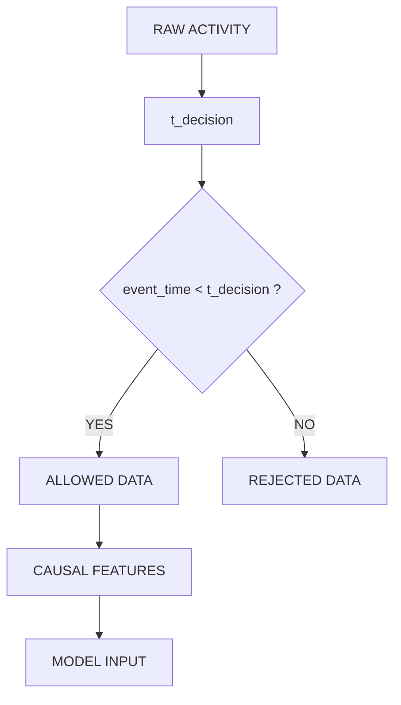
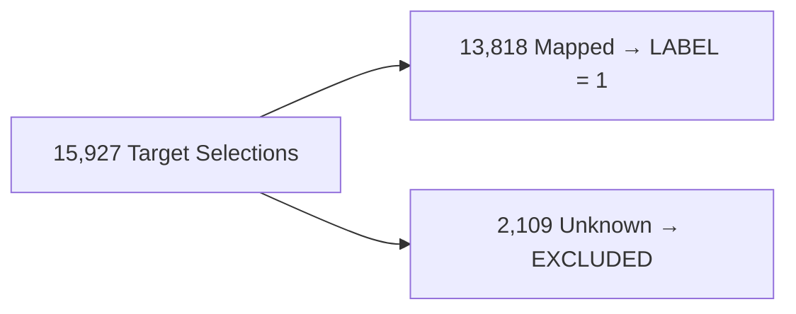

<div align="center">
<pre>
┌─────────────────────────────────────────────────────────┐
│ SOLANA SNIPER — BEHAVIORAL DECONSTRUCTION               │
│                                                         │
│ 411,137 deployments        13,818 mapped positives      │
│                                                         │
│             0% unseen-deployer overlap                  │
│                                                         │
│ PR-AUC             UNSEEN PR-AUC         BOT CAPTURE    │
│ 0.286              0.396                 47.8%          │
│                                                         │
│ PRECISION          SELECTION RATIO                      │
│ 31.7%              1.50×                                │
└─────────────────────────────────────────────────────────┘
</pre>
  
  <h3>Dominant fingerprint:<br>
  LOW PRIOR LAUNCH HISTORY + NON-TRIVIAL DEPLOYER AGE</h3>

  <p><strong>Can we reconstruct the dominant observable decision policy of a Solana sniper using only point-in-time on-chain evidence—without fabricating execution or economic outcomes?</strong></p>
  
  <blockquote>
    <p><strong>Important:</strong> This is a behavioral reconstruction, not a claim of complete economic replication. The supplied dataset does not expose the bot's complete buy/exit execution history. We explicitly distinguish absence of evidence from negative evidence.</p>
  </blockquote>

  <p>
    <a href="https://github.com/shambhushekharsinha-engg/pumpfun-zero-block-deconstruction/actions"></a>
    <a href="LICENSE"></a>
  </p>
</div>

---

## 🔒 Leakage Firewall & Unknown-Label Handling

We strictly enforced a chronological isolation boundary. All features are aggregated at $t_{decision}$ strictly using data from $t < t_{decision}$.


*Leakage Tests Passed: Layer A (source-event timestamp) | Layer B (aggregate construction) | Layer C (adversarial future feature)*

### Handling the Unknown Positives
Of the original target selections, 2,109 could not be mapped to the launch universe.

> **Unknown ≠ Negative.** This is an absolute scientific integrity rule.

---

## 🔬 Core Discoveries & Baseline Comparison

Because positive prevalence is only ~4.7%, precision-recall evaluation is far more informative than accuracy.

<pre>
Random prevalence     ≈ 4.7%
PR-AUC Random baseline  ─── 0.047
Full model              ─── 0.286
Unseen deployers        ─── 0.396
</pre>

The behavioral signal remained predictive on a strictly unseen-deployer cohort, achieving PR-AUC 0.396. This proves the model discovers a generalized rule rather than memorizing identities.

---

## 📈 Behavioral Efficiency: Capturing the Target Without Fabricated Economics

We do not claim economic outperformance because the supplied dataset does not expose the required execution and exit information. Instead, we optimized for **behavioral selection efficiency**.

Under a pre-registered **Top-5% operating policy** evaluated on the frozen test set, our Replica achieved:
- **47.8% target-selection recall**
- **31.7% precision**
- **1.50× selection ratio**

---

## 🧩 Failure Analysis: The Residual Regime

Where does the replica fail? The observable feature space explains the dominant regime (Shared), but not the complete target policy (Bot-only).

<pre>
Dominant Regime (Shared)        → past_launches ≈ low
Residual Regime (Bot-only)      → past_launches ≈ very high
</pre>

The target bot contains a secondary regime comprising 1,536 selections characterized by extreme serial deployers.

| Explanation | Evidence | Status |
|-------------|----------|--------|
| Missing wallet relationships | Plausible | Hypothesis |
| Missing metadata | Plausible | Hypothesis |
| Off-chain signals | Possible | Unverified |
| Capital/availability constraints| Possible | Unverified |
| Random residual | Not established | Unknown |

*Off-chain metadata is one plausible explanation, but the supplied dataset does not allow this hypothesis to be tested.*

---

## 📂 Repository Structure
```text
.
├── .github/ workflows/     # CI/CD pipelines
├── submission/
│   ├── notebook/           # The final Kaggle showcase Jupyter Notebook
│   ├── results/            # Frozen experiment manifest, metrics, tables, figures
│   ├── src/                # Modularized causal feature engine and ML pipeline
│   ├── tests/              # Strict reproducibility and leakage tests
│   ├── Kaggle_Writeup.md   # The detailed scientific narrative
│   ├── OBSERVABILITY.md    # What we can/cannot observe
│   ├── FINAL_RESULTS.md    # The frozen scoreboard
│   └── REPRODUCTION_CONTRACT.md # The strict rules of engagement
├── DATA_DICTIONARY.md      # Schema documentation
└── LICENSE                 # MIT License
```

## 🚀 Reproduction

This pipeline adheres to a strict scientific reproduction contract. 

```bash
# 1. Create a clean virtual environment
python -m venv venv
source venv/bin/activate  # Or `venv\Scripts\activate` on Windows

# 2. Install frozen dependencies
pip install -r submission/requirements.txt

# 3. Execute the pipeline from scratch
# See instructions inside submission/REPRODUCTION_CONTRACT.md
```

## ⚖️ License
This project is licensed under the MIT License. See the [LICENSE](LICENSE) file for details.
