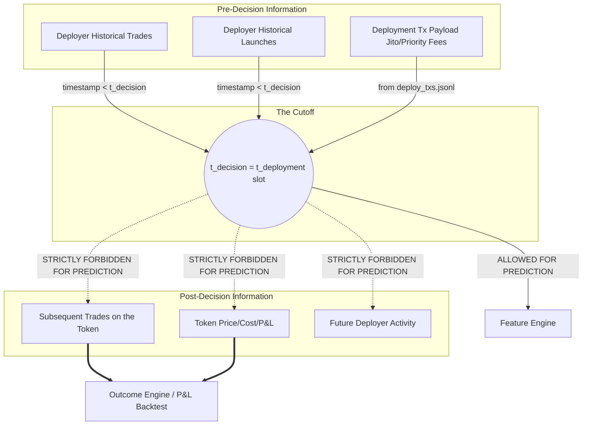

# Time Model

This document establishes the strict temporal rules for preventing look-ahead leakage, derived from the actual dataset schemas.

## Time Definitions

- **`t_deployment`**: The Unix timestamp (`blockTime`) or Solana slot (`blockSlot`) when the token deployment transaction is finalized. 
  - Extracted from: `bought_deploy_txs_index.blockTime` / `blockSlot`.
- **`t_decision`**: Since the target bot is a zero-block sniper, it enters in the *exact same slot* as the deployment. Therefore, the decision point is mathematically identical to the deployment slot.
  - `t_decision = t_deployment` (Specifically, the `blockSlot`).
- **`t_activity`**: The timestamp of any historical event performed by a wallet.
  - Extracted from: `bought_deployers_activity.timestamp`.

## Information Flow and Constraints

### Critical Rules Discovered
1. **No Bonding Curve Data**: Because `t_decision` is the zero-block, there is zero price action or bonding curve data available at the time of decision. Price features (`price_usd`, `cost_usd`) from `bought_deployers_activity` must NEVER be used in the feature engine.
2. **Strict Inequality**: When aggregating historical wallet behavior, the condition must be `timestamp < t_deployment` (strictly less than, to avoid leaking the launch itself or subsequent rapid buys).
3. **Payload Extraction**: Information parsed from `deploy_txs.jsonl` (like how much SOL the dev bought, priority fees, Jito tip) is available at `t_decision` because the bot observes the mempool or the bundle before it lands.
