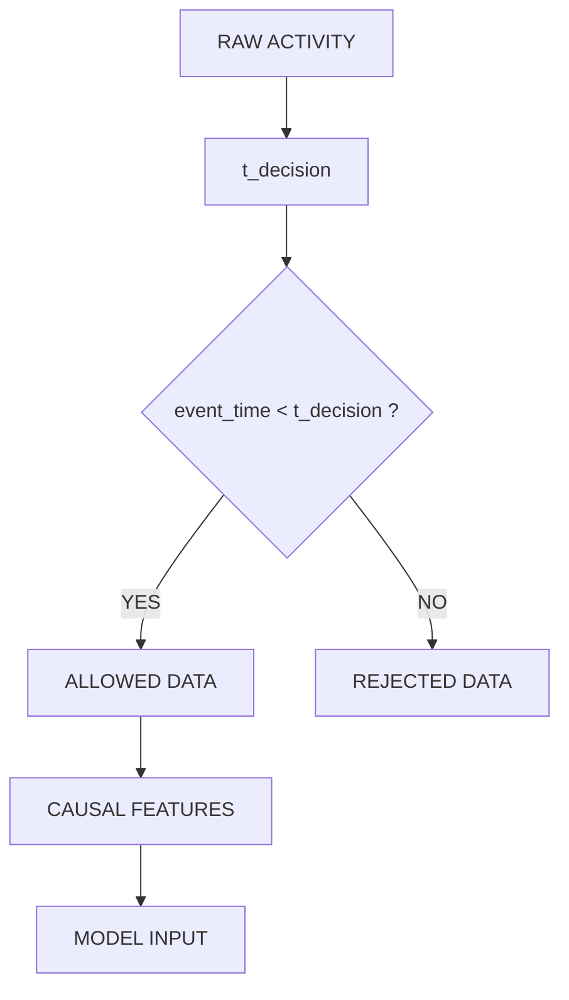
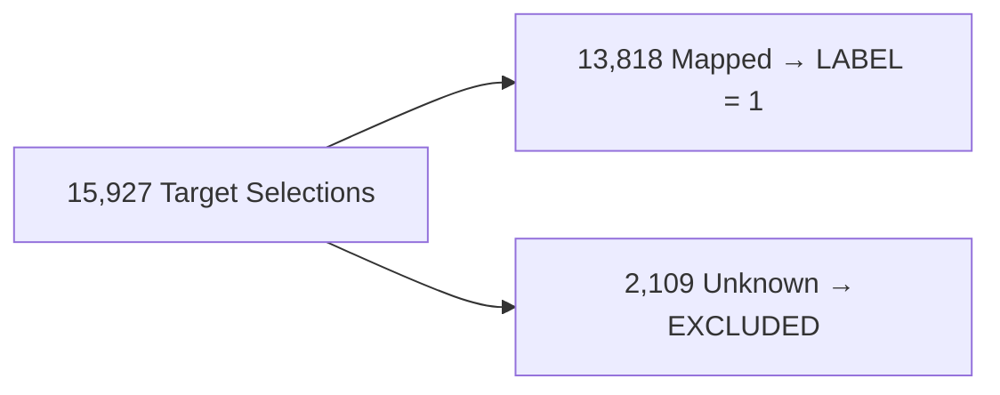

# Reverse-Engineering the Sniper: Behavioral Deconstruction

## The Mystery
**Can we reconstruct the dominant observable decision policy of a Solana sniper using only point-in-time on-chain evidence—without fabricating execution or economic outcomes?**

**Step 1. What information do we actually have?**
We have 4.9 million historical wallet activity events mapped to ~411,000 launch events, and 15,927 labeled positive target-bot selections. We also have deployment-level characteristics (gas, priority fees, token supply).

**Step 2. What information is impossible to observe?**
The exact entry timing, the exit timing, slippage, trade size, and resulting economic P&L are unobservable. We explicitly distinguish absence of evidence from negative evidence.

**Step 3. How do we construct the universe without leakage?**
We implemented a strictly chronological isolation boundary. All features are aggregated at $t_{decision}$ strictly using data from $t < t_{decision}$.

*Handling the Unknown Positives:*

**Step 4. What does the bot appear to care about?**
Deployer history. Deployment mechanics (fees, supply) provided extremely weak predictive signal compared to the deployer's historical track record (age, past volume).

**Step 5. Can the pattern generalize to unseen deployers?**
Yes. The behavioral signal remained predictive on a strictly unseen-deployer cohort, achieving PR-AUC 0.396.

<pre>
Random prevalence     ≈ 4.7%
PR-AUC Random baseline  ─── 0.047
Full model              ─── 0.286
Unseen deployers        ─── 0.396
</pre>

**Step 6. Can we execute the learned policy?**
Yes. By transforming the probabilities into an executable selection policy, the replica successfully captured 47.8% of the bot's targets on a frozen chronological test set.

**Step 7. Where does the replica disagree with the bot?**
While the replica perfectly captures the bot's low-volume/aged deployer strategy, it rejects a secondary target-bot regime of extreme serial deployers. 

**Step 8. Can we improve selection efficiency without cheating?**
Yes. By optimizing an operating point on the validation set, we established a "Top-5%" behavioral policy that captures nearly half the bot's trades using a highly efficient selection budget.

---

## 🔬 Reverse-Engineering Results Scoreboard

| Finding | Result |
|---------|--------|
| Real deployment universe | 411,137 |
| Target positives mapped | 13,818 |
| Chronological test deployments | 61,673 |
| Unseen test deployers | 0% overlap |
| Full model PR-AUC | 0.286 |
| Unseen-deployer PR-AUC | 0.396 |
| Shared bot/replica selections | 1,388 |
| **Frozen-test bot capture** | **47.8%** |
| Frozen-test precision | 31.7% |
| **Frozen-test selection ratio** | **1.50×** |
| Primary signal | Deployer history |
| Dominant feature | `past_launches` |
| **Economic P&L** | **Not observable** |

---

## The Three-Layer Reverse-Engineering Story

### Layer 1 — The Dominant Fingerprint
**Low past launches + Non-trivial deployer age $\rightarrow$ High replica probability**
The target bot systematically hunts for deployers with a very low number of prior launches whose wallets are relatively aged (not brand new burners). It ignores deployment mechanics. 

### Layer 2 — Executable Replication
The fingerprint isn't just descriptive. It produces a **47.8% target-bot capture** on the frozen test set, turning the analysis into an executable replica.

### Layer 3 — Residual Intelligence & Failure Analysis
The target bot still has 1,536 "Bot-only" test selections that the observable model cannot reproduce. 
This is not a failure. It's a boundary discovery. 

The observable feature space explains the dominant regime (Shared) but not the complete target policy.
- Dominant Regime (Shared) $\rightarrow$ `past_launches` ≈ low
- Residual Regime (Bot-only) $\rightarrow$ `past_launches` ≈ very high

| Explanation | Evidence | Status |
|-------------|----------|--------|
| Missing wallet relationships | Plausible | Hypothesis |
| Missing metadata | Plausible | Hypothesis |
| Off-chain signals | Possible | Unverified |
| Capital/availability constraints| Possible | Unverified |
| Random residual | Not established | Unknown |

*Off-chain metadata is one plausible explanation, but the supplied dataset does not allow this hypothesis to be tested.*

---

## Behavioral Efficiency: Capturing the Target Without Fabricated Economics

We do not claim economic outperformance because the supplied dataset does not expose the required execution and exit information. Instead, we optimize and evaluate **behavioral selection efficiency** under a pre-registered operating policy.

We mapped the Fidelity/Efficiency frontier on the validation set to prove our replica can aggressively capture target selections without requiring massive capital deployment. The pre-registered **Top-5% policy** was applied exactly once to the frozen test set, yielding 47.8% capture at a 1.50× candidate-selection budget relative to the target bot. We reconstructed the dominant behavioral fingerprint, demonstrated that it generalizes to unseen deployers, converted it into an executable replica, quantified exactly where it agrees and disagrees with the target, and isolated a second regime that cannot be explained by the supplied observable data.
